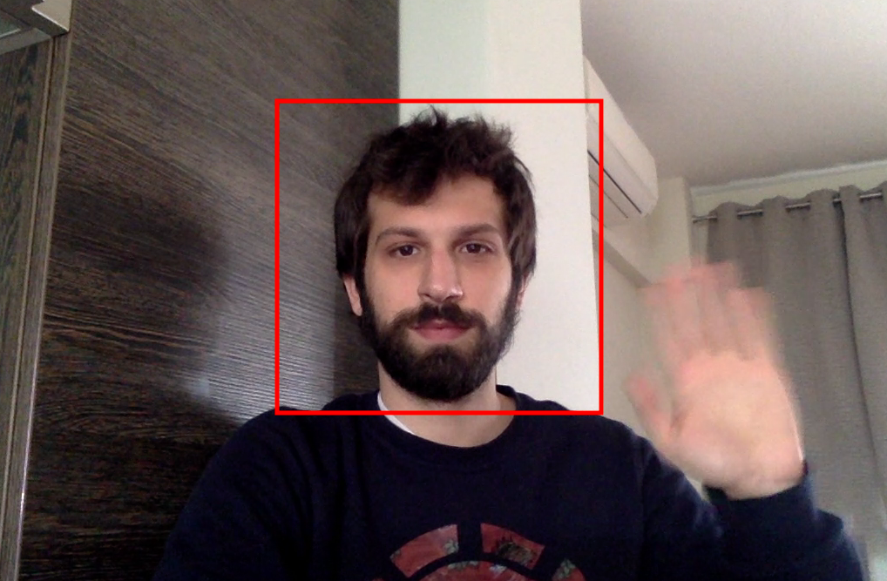

# Face-Detection-Python-OpenCV-Live-Video
In this project a face detection application is developed, using my own laptop camera with OpenCV and Python. 

# Example: 

# Scripts
In the following scripts, the connection, open, recording and saving a video file from the laptop's camera takes place. Followed by the drawing and interraction on live video with OpenCV - 2 and Python 3, comes the Face Detection script on the live video !!

*Although i am using a Macbook, info for Windows is also included.
